--- 
title: "Lab 8"
description: "Lab Description and Report"
layout: default
---

# Lab 8: Stunts!

The goal of this lab was to make our car do a stunt, and I chose to make my car drift. I did this by having the car drive directly towards a wall, start turning 180° around once it was within three feet of the wall, and then drive back in the same direction it originated after turning.

### Updated Software

In order to accomplish the drift, I added a new function named `do_the_drift()` to the code on the Artemis. This function was called once in every `void loop()` iteration so long as the global variable `initiate_drift` was `1`.

```cpp
void loop() {

   Connect via bluetooth

   While bluetooth is connected:
	
	...all code from previous labs…

	if (initiate_drift){
	       do_the_drift();
	}
}
``` 

The `initiate_drift` flag, as well as other flags used within `do_the_drift()`, were all set when the Artemis received a `DRIFT` command from my laptop.

```python
drift_speed = 130 # pwm value at which the motors ran when moving straight
goal_angle = 180.0 # the angle the car should move its heading to (it boots up at 0°) 
drive_seconds = 1 # how long to drive away from the wall for
turning_distance = 910 # the distance at which the car should start turning

string = str(drift_speed) + "|" + str(goal_angle) + "|" + str(drive_seconds) + "|" + str(turning_distance)

ble.send_command(CMD.DRIFT, string)
```

The `do_the_drift()` function incorporated a lot of the distance PID controller I previously developed, except the PWM value sent to the motors did not change with respect to distance. Instead, the motors ran at a constant PWM value `drift_speed`, which is set by the `DRIFT` command. The Kalman filter was used to determine how far away the car was from the wall based on the ToF readings and the model of the system.

Once the car was within `turning_distance` mm from the wall, the value of which was set via the same bluetooth command mentioned above, `do_the_drift()` then stopped the car from driving forward and called the previously made `run_angular_pid()` to rotate the car 180°. It also sets the value of the `do_turn` flag from `0` to `1`. This ensured that this section of code started running once the car was close enough to the wall, and continued to run while the car was spinning even though the measured distance in front of it would change as it was spinning. The `run_angular_pid()` function was called until the car was within ±10° of 180°. Not enforcing the car to turn to exactly 180° allowed for the car to begin driving back more quickly. Once the heading of the car was close enough to 180°, `done_spinning` was set to `1` and this section of code would no longer be entered.

```cpp
if ( ((kalman_distance_output <= turning_distance) || (do_turn)) && !done_spinning){
           do_turn = 1;
           pwm_input_d = 0;
           run_angular_pid();
           if (spin_achieved >= spin_checks){
               do_turn = 0;
               done_spinning = 1;
           }
}
```

After the car had finished spinning, all it had to do was drive forward again. To do this, I simply ensured that a PWM signal of `drift_speed` was sent to the motors for `drive_seconds` seconds. I decided that it was not necessary to report the PWM value or Kalman filter output for this portion of the stunt because the PWM value was constant and known and the distance between the car and any objects in front of it no longer impacted the behavior of the system.


```cpp
if (done_spinning){
           cur = millis();
           pwm_input_d = drift_speed;
           while( millis() < (cur + drive_seconds*1000) ){
               drive_motors(pwm_input_d);
               driving_back = 1;
           }
           stop_motors();
           initiate_drift = 0;
           driving_back = 0;
}
```

### Drifting

After the program was updated, completing a stunt became a manner of balancing my angular PID constants with how fast I commanded the car to drive towards the wall. I ended up using a new `kd` value of `0.05`, which was originally `0.03`. This allowed the car to slow down a little bit more during the rotation, which helped with not overshooting a heading of 180°.

The following two stunts were performed with a PWM input of 100:

#### Stunt 1

<iframe width="560" height="315" src="https://www.youtube.com/embed/3n78RNZNCmE" title="ECE 4160: Lab 8 Fast Drift" frameborder="0" allow="accelerometer; autoplay; clipboard-write; encrypted-media; gyroscope; picture-in-picture; web-share" allowfullscreen> </iframe> 

# 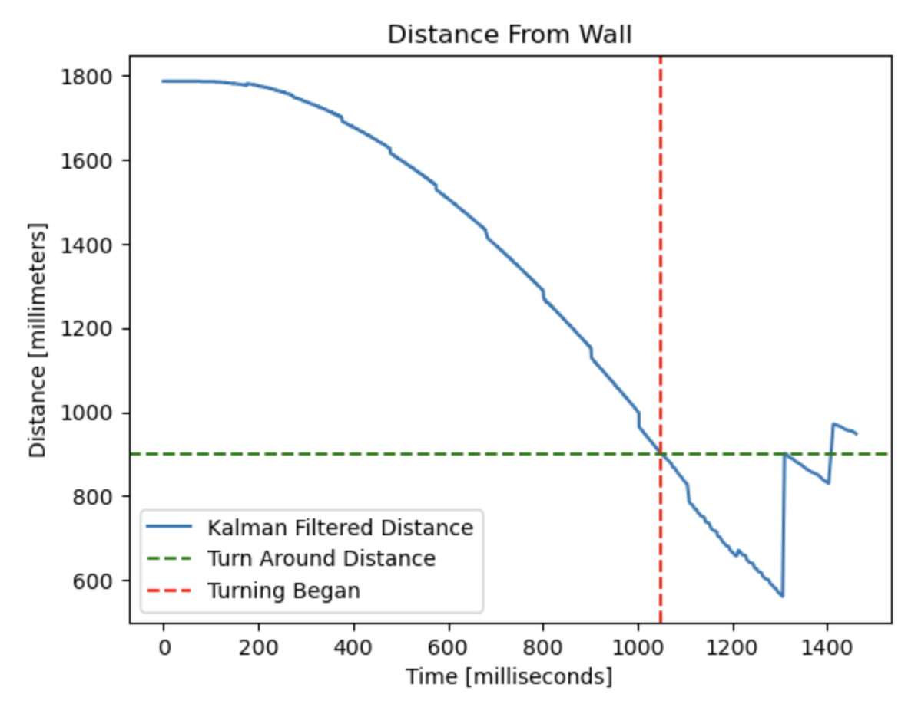

# 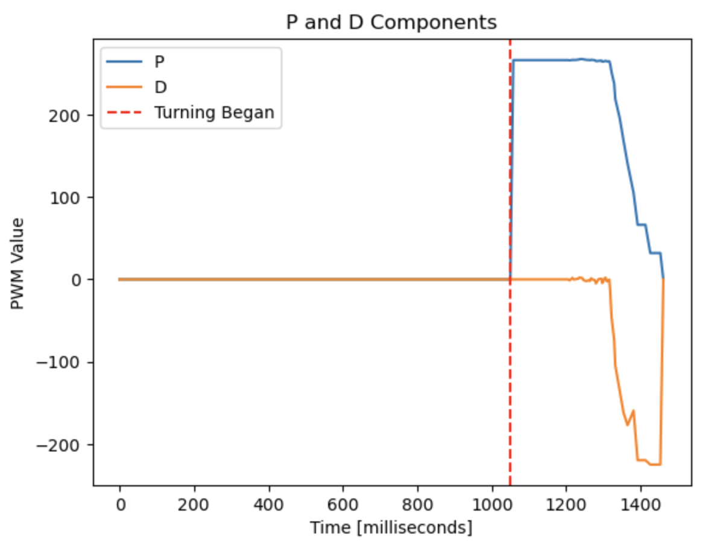

# 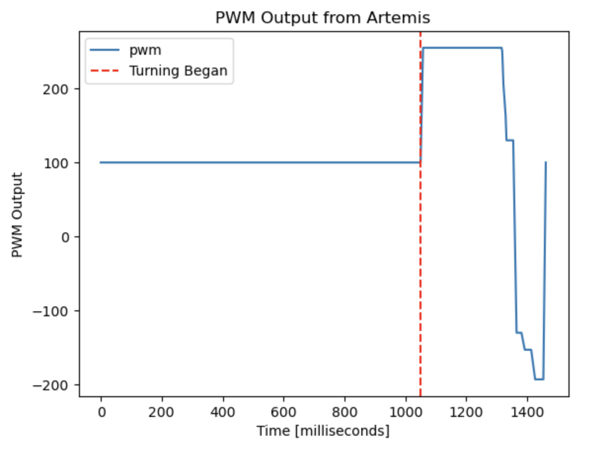

#### Stunt 2


<iframe width="560" height="315" src="https://www.youtube.com/embed/N5u-sozBWPo" title="ECE 4160: Lab 8 Fast Drift" frameborder="0" allow="accelerometer; autoplay; clipboard-write; encrypted-media; gyroscope; picture-in-picture; web-share" allowfullscreen> </iframe> 

# 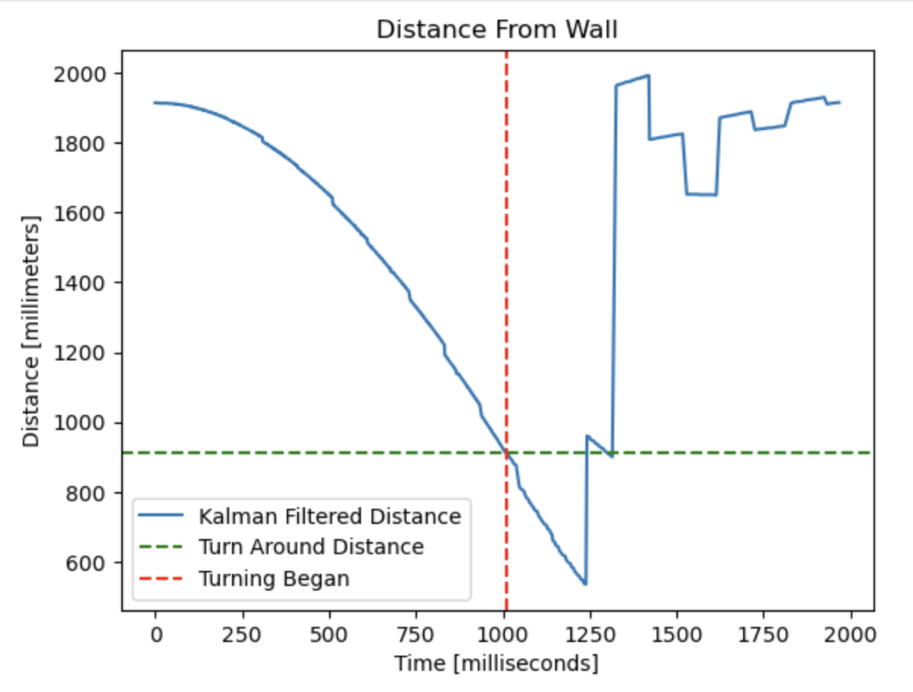

# 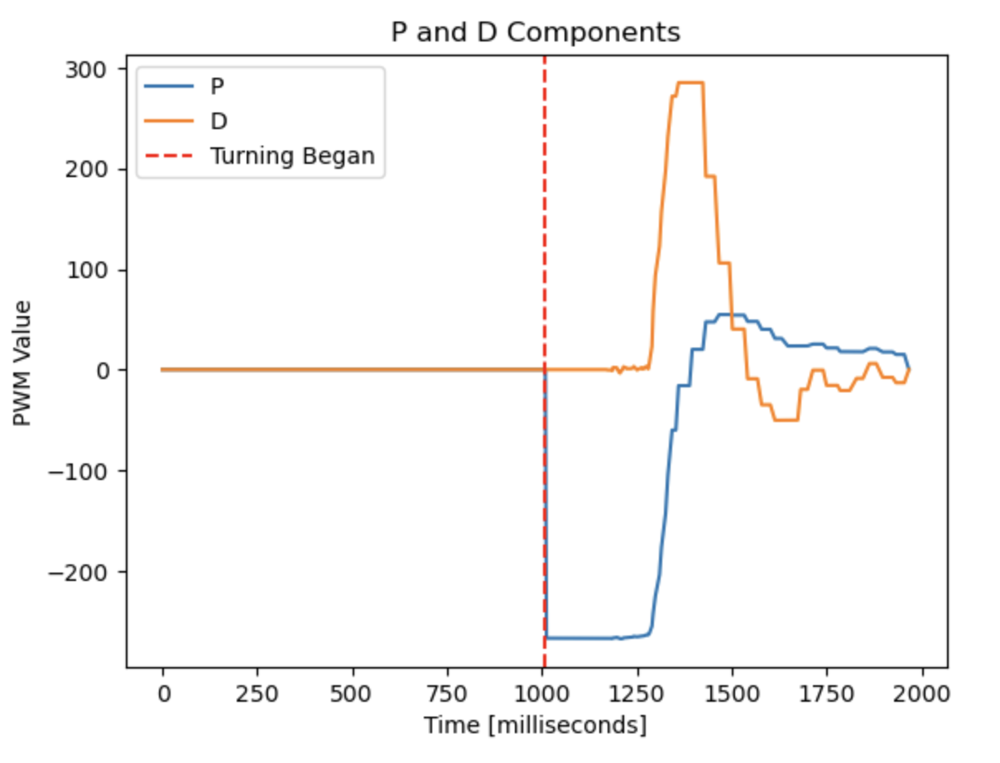

# 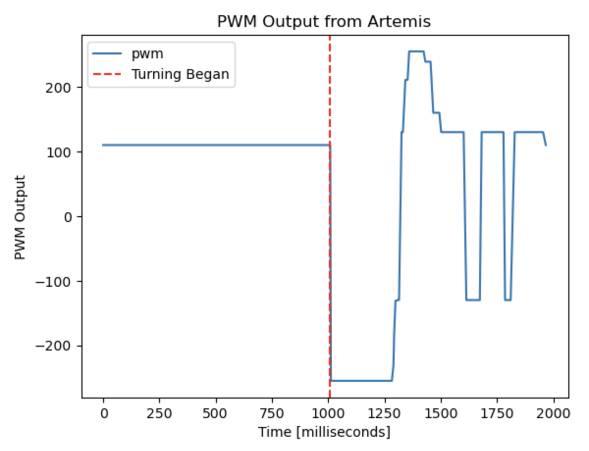

#### Stunt 3

The PWM input was increased to 120 for the following stunt.

<iframe width="560" height="315" src="https://www.youtube.com/embed/Hnl4xYc3TDg" title="ECE 4160: Lab 8 Fast Drift" frameborder="0" allow="accelerometer; autoplay; clipboard-write; encrypted-media; gyroscope; picture-in-picture; web-share" allowfullscreen> </iframe> 

# 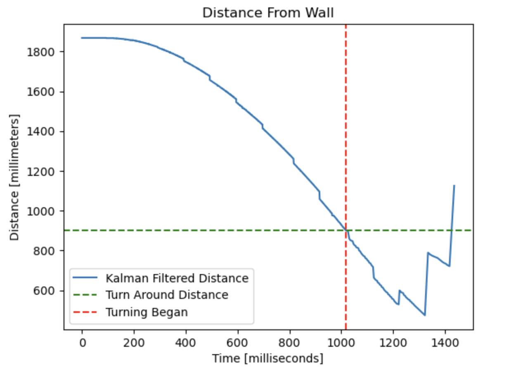

# 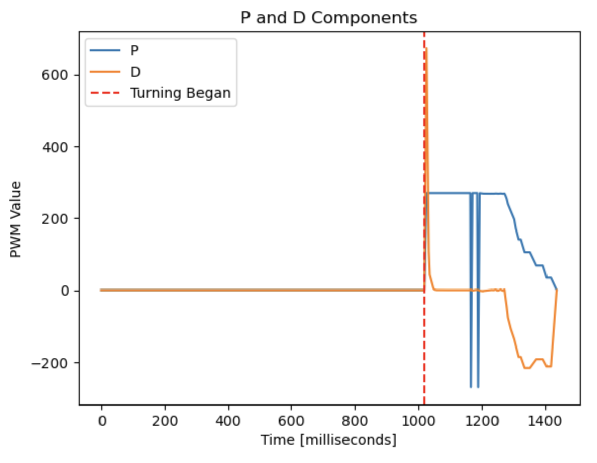

# 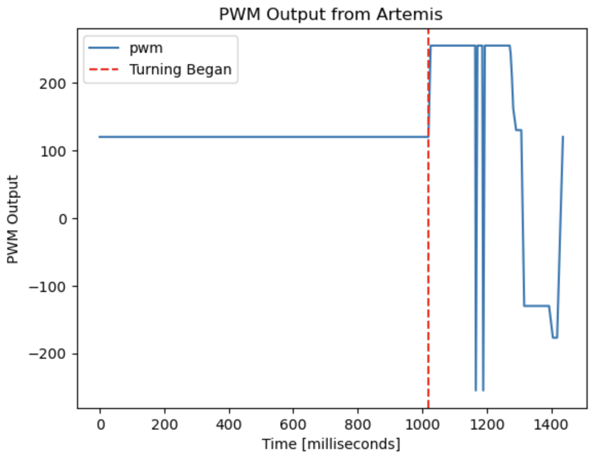

#### Fast Stunt

This stunt had a PWM input of 160. While it was faster and still able to drift, the car overshot the 180° rotation.

<iframe width="560" height="315" src="https://www.youtube.com/embed/uwRHym4mXM4" title="ECE 4160: Lab 8 Fast Drift" frameborder="0" allow="accelerometer; autoplay; clipboard-write; encrypted-media; gyroscope; picture-in-picture; web-share" allowfullscreen> </iframe> 

# 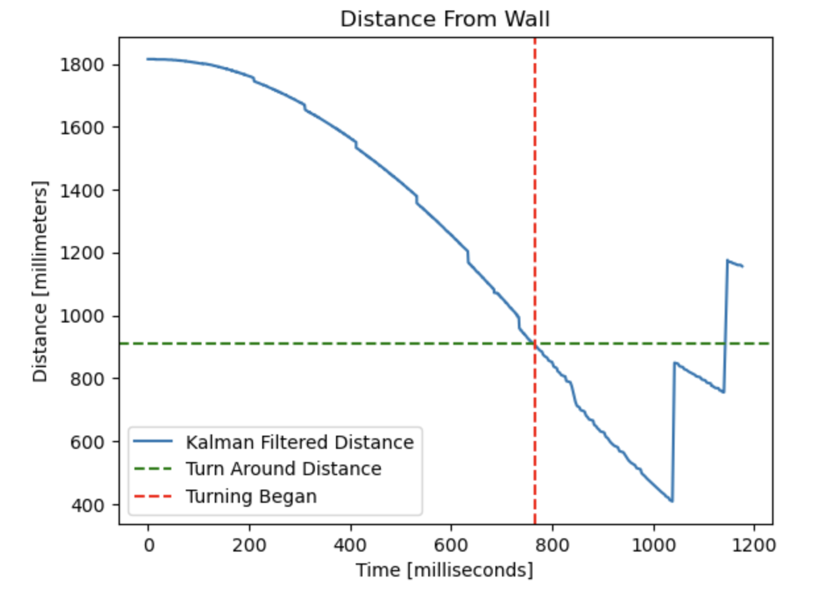

# 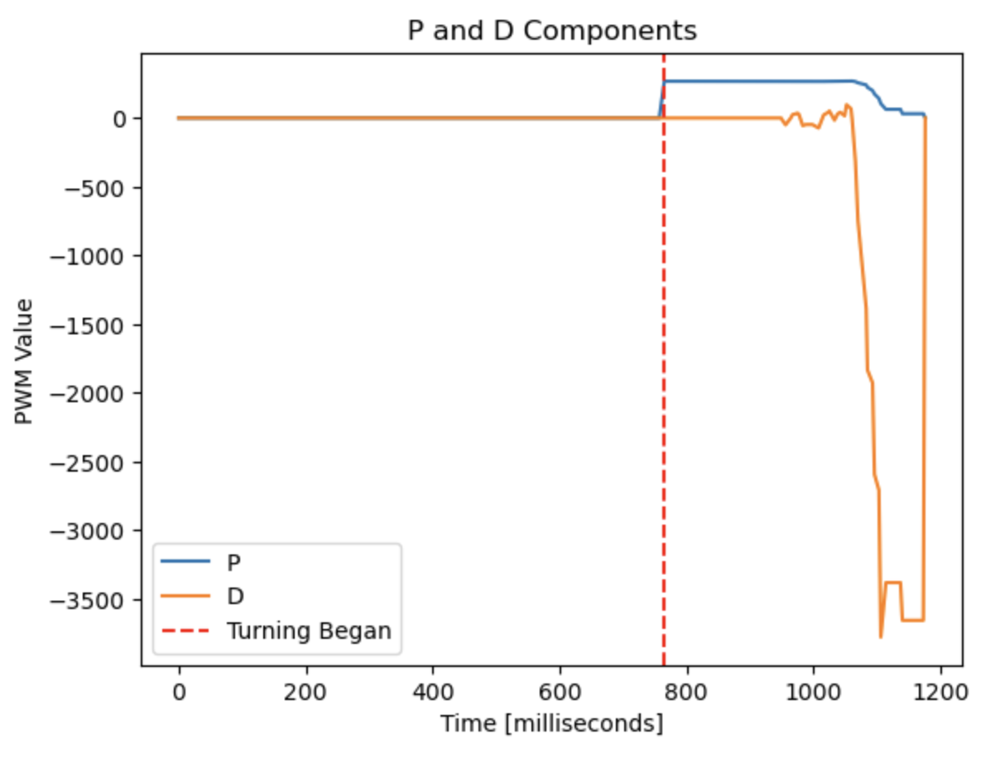

# 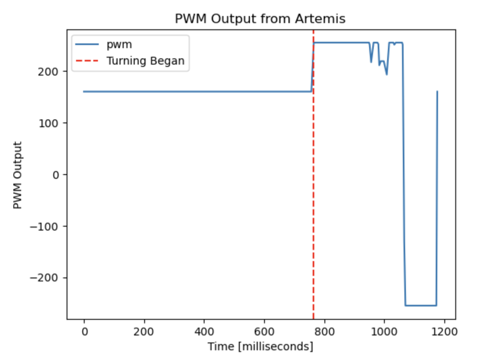

#### Additional Stunts

These videos don’t show ideal behavior for the stunt, but I thought they were worth mentioning.

In the first one, the car somehow managed to do two rotations instead of just one. I am not entirely sure how this happened, but I thought it was cool. However, because of the additional twist, the car seemed to have lost a lot of its original linear momentum and the second rotation experienced less drift than the first.

<iframe width="560" height="315" src="https://www.youtube.com/embed/dlhIX9TBZ08" title="ECE 4160: Lab 8 Double Turn" frameborder="0" allow="accelerometer; autoplay; clipboard-write; encrypted-media; gyroscope; picture-in-picture; web-share" allowfullscreen> </iframe> 

However, not all my attempts at performing this stunt ended as majestically as the ones shown earlier. For example, here my car jitters in place for a little bit, and then proceeds to run full steam ahead into a piece of furniture.

<iframe width="560" height="315" src="https://www.youtube.com/embed/LRG9N9JXt3s" title="ECE 4160: Lab 8 Blooper" frameborder="0" allow="accelerometer; autoplay; clipboard-write; encrypted-media; gyroscope; picture-in-picture; web-share" allowfullscreen> </iframe> 

